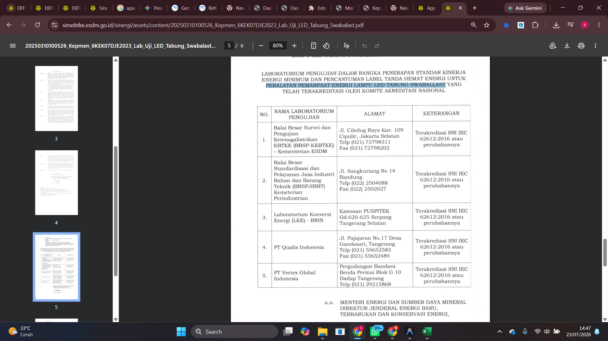
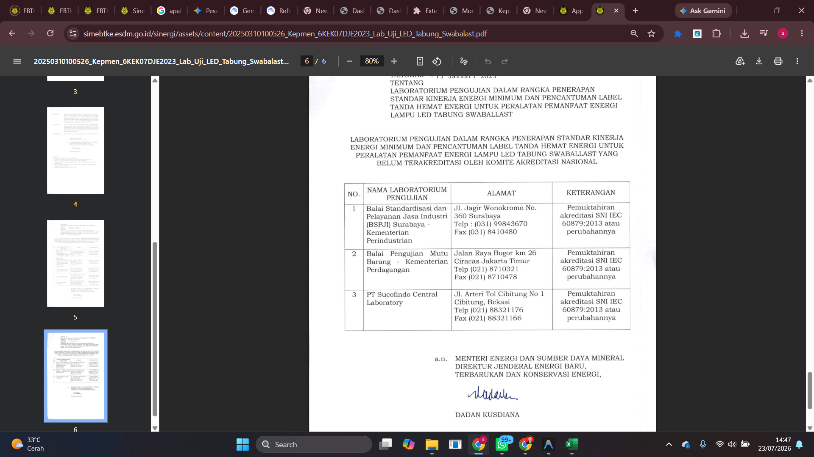

ada tambahan peralatan 
untuk lab Uji 
 dan 
Penunjukan Lab Uji yang telah terakreditasi oleh Komite Akreditasi Nasional sebagaimana dimaksud dalam Diktum KESATU huruf a berlaku untukjangka waktu 4 (empat) tahun, dan dapat diperpanjang sesuai ketentuan peraturan perundang-undangan.
Penunjukan Lab Uji yang belum terakreditasi oleh Komite Akreditasi Nasional sebagaimana dimaksud dalam Diktum KESATU huruf b berlaku untukjangka waktu 2 (dua) tahun.
masa berlaku mulai 13 Januari 2023. 

[text](../../../Downloads/20250310101918_Kepmen_102KEK07DJE2024_LSPro_RDC.pdf) [text](../../../Downloads/20250310101930_Kepmen_103KEK07DJE2024_LSPro_Televisi.pdf)

tambahkan juga itu. 